# Introduction to Algorithms, Fourth Edition &mdash; implementations of algorithms and data structures

### Overview

This project provides implementations of algorithms and data structures found in *Introduction to Algorithms, Fourth
Edition* by Thomas H. Cormen, Charles E. Leiserson, Ronald L. Rivest and Clifford Stein, as well as in the book's [
*Solutions to exercises and problems*](https://github.com/wojtask/clrs4e-solutions)
by Krzysztof Wojtas.
It serves as a companion to the solutions project helping in detecting and fixing bugs or limitations in the suggested
algorithms and data structures.

### Project objectives

* Adaptation of pseudocodes from the textbook and from the solutions to a real programming language.
* Implementation of algorithms and data structures with no explicit pseudocodes, yet precisely described in any of the
  source positions.
* Testing the implementations, especially those from the solutions, to increase confidence in algorithms correctness.
* Laying a foundation for a more sophisticated or practical library of algorithms and data structures for real use.

### Choice of a programming language

**Python 3** was chosen as a programming language for several reasons:

* Python is widely used in academia and is often the programming language of choice in introductory computer science
  courses.
  It is also widely used in many business applications.
  That makes it widely known in many communities, both academic and professional.
* Python's syntax and semantic show many similarities to pseudocode used in the textbook and the solutions.
  This enables easily transitioning between the two ways of expressing algorithms.
* Python does not limit developers with a single programming paradigm, making it elastic to adapt to different models
  found in pseudocodes.
* Python's typing system resembles the rules followed in pseudocode, particularly dynamic typing and duck typing.

The implementations are written in a way to be as close as possible to the algorithms in the textbook or in the
solutions, both in terms of syntax, and behavior.
This principle lead to using the procedural paradigm whenever possible and applicable, as well as translating pseudocode
instructions to most relevant Python statements or expressions.
Algorithms with no pseudocodes provided are implemented in a more flexible and often more concise way, more resembling
an idiomatic Python code.
The code in such cases is often appropriately structured to increase readability.

### History and Future

A couple of yeas ago I started implementing the algorithms from the second edition of the book while working on the
book's [solutions](https://github.com/wojtask/CormenSol) in Polish.
On GitHub there are legacy projects written in [Java](https://github.com/wojtask/CormenImpl)
and [Python](https://github.com/wojtask/CormenPy).
Soon after the fourth edition of the book got published, I deprecated those projects and began working on the solutions
to the fourth edition by migrating the old material, i.e. adapting it to the new edition and translating it to English.

I plan to adapt the implementations similarly by moving (and if necessary updating) the legacy code as I work on solving
exercises in each chapter.
Therefore, the progress on the implementations almost entirely depends on
the [progress](https://github.com/wojtask/clrs4e-solutions#progress) in the solutions.

I also plan to rethink the approach to testing by introducing two test categories &mdash; fast and deterministic unit
tests and robust property-based tests for generating random test cases.
The idea is to make writing tests easier and better control their execution.
By delegating the generation of test cases to libraries such as [Hypothesis](https://hypothesis.works/), I could
simplify many legacy tests that implemented their own test cases generators.
Also, keeping the two test types separated, I could better control when each are run, which would lead to speeding up
the testing process.
This can be achieved by running only the fast unit tests synchronously during build's test phase, and defining an
asynchronous mechanism for running the other tests.

### Pseudocode translation rules

The table below lists the rules followed in the implementation from translating pseudocode constructs into Python
instructions.

| Type                       | Pseudocode construct                                                                                                                                                       | Translated Python code                                                                                     | Remarks                                                      |
|----------------------------|----------------------------------------------------------------------------------------------------------------------------------------------------------------------------|------------------------------------------------------------------------------------------------------------|--------------------------------------------------------------|
| predefined constant        |  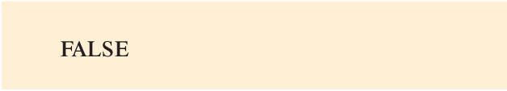  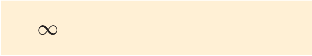                                                    | `True` `False` `None` `math.inf`                                                               |                                                              |
| custom constant            | 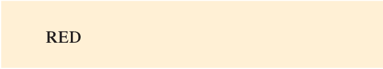 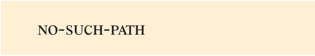                                                                                        | `RED` `NO_SUCH_PATH`                                                                                   | defined as a standalone or an enum value                     |
| variable                   | 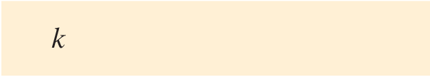 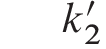                                | `k` `k2_` `best_score`                                                                             |                                                              |
| object's attribute         | 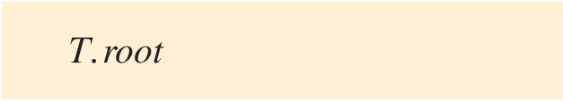 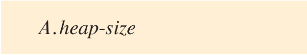 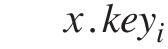                             | `T.root` `A.heap_size` `x.key[i]`                                                                  | indexed attributes are implemented as an `Array`             |
| fixed function             | 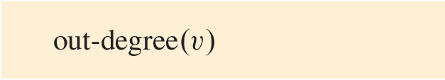                                                                                                                               | `out_degree(v)`                                                                                            | defined in a separate module                                 |
| assignment                 | 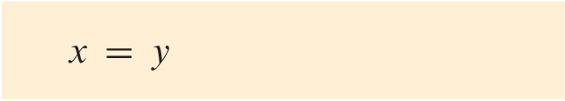                                                                                                                                       | `x = y`                                                                                                    |                                                              |
| shifting a variable        | 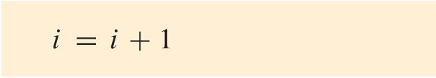 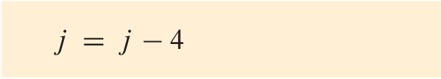                                                                                                  | `i += 1` `j -= 4`                                                                                      |                                                              |
| condition                  | 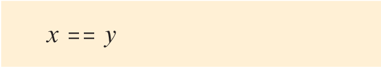 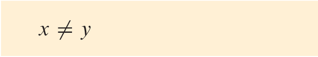 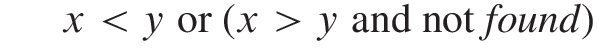                                     | `x == y` or `x is y` `x != y` or `x is not y` `x < y or (x > y and not found)`                     | depends on the compared variables type: scalars or pointers  |
| procedure call             | 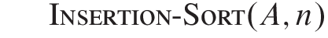                                                                                                                               | `insertion_sort(A, n)`                                                                                     |                                                              |
| returning from a procedure | 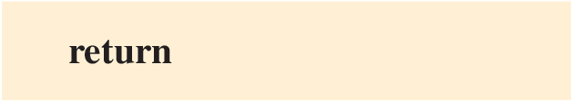 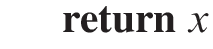 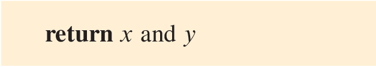 | `return` `return x` `return x, y`                                                                  |                                                              |
| exchanging values          | 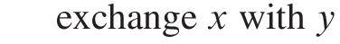 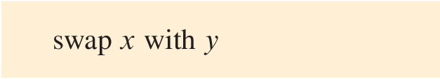                                                                                                              | `x, y = y, x`                                                                                              |
| signaling error            | 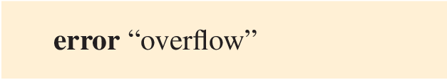                                                                                                                                                 | `raise ValueError('overflow')`                                                                             |
| printing                   | 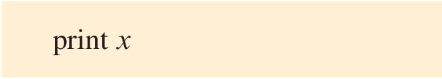                                                                                                                                                 | `print(x)`                                                                                                 |
| creating a new array       | 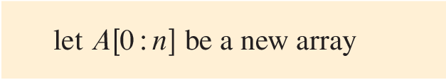                                                                                                                                         | `A = Array(0, n)`                                                                                          |
| referencing an array cell  | 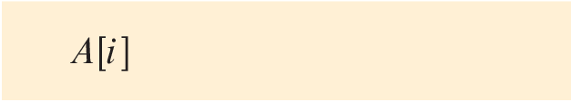                                                                                                                                       | `A[i]`                                                                                                     |
| creating a new set         | 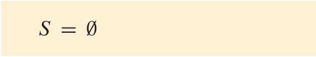                                                                                                                                             | `S = set()`                                                                                                |
| union of sets              | 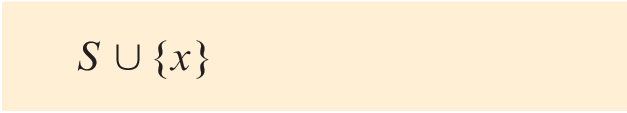                                                                                                                                     | `S \| {x}`                                                                                                 |
| set cardinality            | 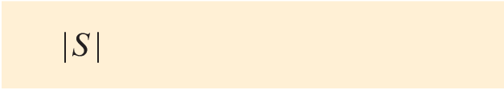                                                                                                                             | `len(S)`                                                                                                   |
| floor division             | 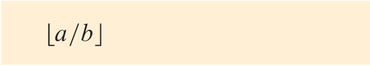                                                                                                                               | `a // b`                                                                                                   |
| ceiling division           | 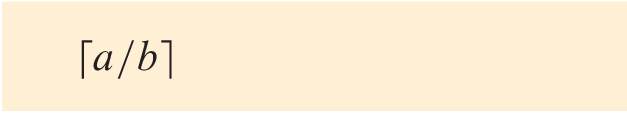                                                                                                                           | `-(a // -b)`                                                                                               |
| minimum                    | 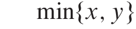                                                                                                                                             | `min(x, y)`                                                                                                |
| maximum                    | 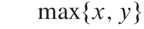                                                                                                                                             | `max(x, y)`                                                                                                |
| *if* statement             | 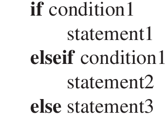                                                                                                                                   | <pre>if condition1:   statement1 elif condition2:   statement else:   statement3</pre> |
| indexed *for* loop         | 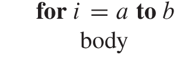 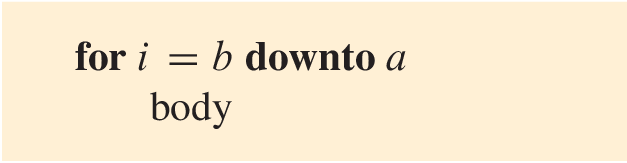                                                                                  | <pre>for i in a \|to\| b:   body</pre> <pre>for i in b \|downto\| a:   body</pre>              | `\|to\|` and `\|downto\|` are custom defined infix operators |
| *for each* loop            | 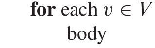                                                                                                                                 | <pre>for v in V:   body</pre>                                                                          |                                                              |
| *while* loop               | 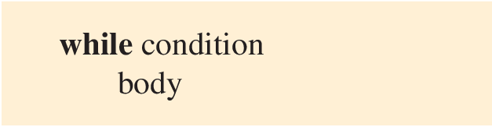                                                                                                                                       | <pre>while condition:   body</pre>                                                                     |                                                              |
| *repeat* loop              | 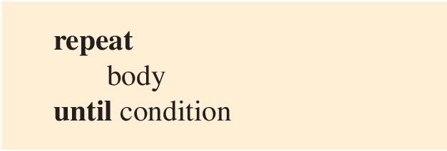                                                                                                                                     | <pre>while True:   body   if condition:     break</pre>                                        |                                                              |

**Stay tuned for more information once I migrate some amount of code.**
